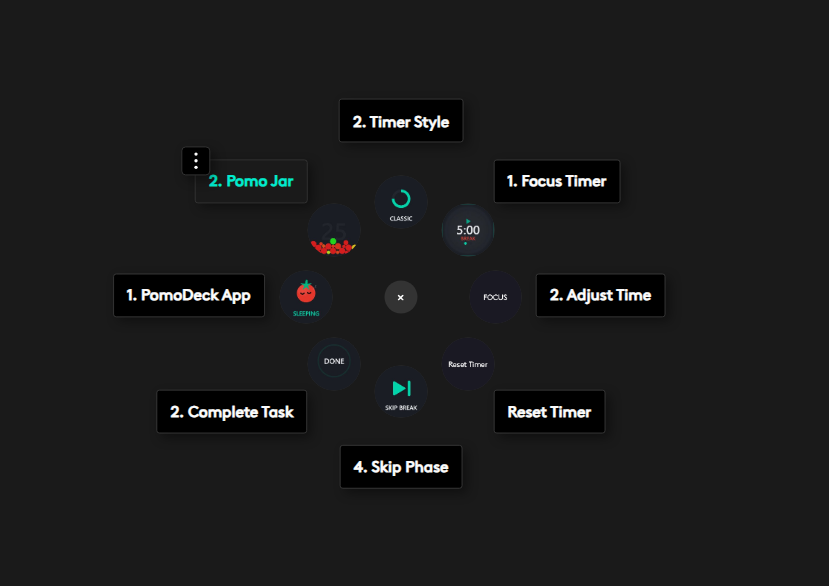

# PomoDeck

  

**Focus you can feel.**

PomoDeck solves the three biggest hurdles to productivity: distraction, awareness, and motivation.

---

## Inspiration

We've all been there. You open a browser tab for "quick research" and surface 45 minutes later deep in a YouTube rabbit hole. Pomodoro apps exist — dozens of them — but they all live on the same screen that's distracting you. They're a notification you dismiss, a tab you forget, a phone timer you ignore.

Then we looked at the Logitech MX Creative Console sitting on the desk. Physical buttons. An LCD touchscreen. A dial. Haptic feedback on the MX Master 4. What if the Pomodoro timer wasn't on your screen at all? What if it was a physical object you could touch, twist, and feel?

That's PomoDeck. A Pomodoro timer that lives in your hands, not in your browser. The console becomes a focus coach: color-coded phases you see at a glance, a dial you twist to set your rhythm, a haptic pulse that tells your body it's break time before your eyes leave the code.

The original Pomodoro was a tomato-shaped kitchen timer. PomoDeck brings that tactile, analog feeling back to productivity — powered by modern hardware and a desktop app that makes the whole system intelligent.

---

## What We Proposed vs. What We Shipped

In Round 1, we proposed a plugin-only timer with 6 actions, basic app blocking, and session counting. Here's what we actually delivered:

  

### The Plugin (9 actions, SkiaSharp rendered, haptic feedback)

| Action | What It Does |
|--------|-------------|
| **Focus Timer** | Live countdown with Classic dial or Liquid water-fill display. Tap to start/pause. Double-tap to switch style |
| **Adjust Time** | Physical dial: turn to change duration 1–120 min. Press to cycle Focus/Break/Long Break. Triple-press resets to 25-5-15 |
| **Reset Timer** | Reset current phase to start (paused only — can't accidentally reset mid-focus) |
| **Skip Phase** | Jump to next phase with per-phase audio feedback |
| **Active Task** | Shows current task with color tag and progress dots. Press to cycle. Double-press to add new task |
| **Complete Task** | Animated checkmark with trim-path drawing. Next task activates automatically |
| **PomoDeck App** | Tomato mascot with 6 flow-driven poses (Sleeping → Deep Flow). Press to show/hide app |
| **Pomo Jar** | Physics-based jar collecting today's sessions as colored tomatoes. Press to open stats |
| **Sound** | Toggle focus tick on/off. Syncs with app setting |

### The Desktop App (Tauri 2 + Svelte 5 + Rust)

| Feature | Description |
|---------|-------------|
| **Flow Scoring** | Real-time 0–100 score with 6 named levels. Builds on sustained focus, drops on distraction |
| **Web Blocking** | PAC proxy blocks distracting sites during focus. Unblocks on break automatically |
| **App Blocking** | Process monitor minimizes distracting apps during focus. Configurable blocklist |
| **Task Management** | Color-tagged tasks with pomo estimation, progress tracking, and completion stats |
| **Statistics** | Daily flow graph (24h axis, live updates), weekly bar chart with physics jars, yearly activity heatmap |
| **Theme System** | Dark (teal accent) and Light (purple accent). Syncs to plugin instantly |
| **WebSocket Sync** | Bidirectional real-time sync — every setting, every state change, every theme switch |
| **System Tray** | Auto-start on boot, minimize to tray, tray icon with progress arc |
| **8 Languages** | English, Spanish, French, German, Japanese, Chinese, Portuguese, Turkish |
| **Custom Sounds** | Phase complete, task done, skip feedback, tick — all replaceable |
| **Onboarding** | First-launch guide: install plugin → assign buttons → press start |

### What We Proposed → What We Shipped

| Proposed (Round 1) | Shipped |
|--------------------|---------|
| 6 plugin actions | **9 actions** with SkiaSharp rendering and press animations |
| Basic app blocking (minimize) | **Web + app blocking** with PAC proxy, focus page, and real-time blocklist editing |
| Session counting (emoji row) | **Physics-based Pomo Jar** with flow-colored tomatoes and weekly value scoring |
| Static button icons | **Animated mascot** with 6 flow-driven poses, smooth interpolation, and eye animations |
| No desktop app | **Full Tauri desktop app** with flow scoring, statistics, task management, and theme system |
| No sync | **Bidirectional WebSocket sync** — app and plugin are one system |
| No flow tracking | **Real-time flow scoring** with accelerating momentum, pause penalties, idle detection, and break decay |
| No statistics | **Three-tab stats window** — daily flow graph, weekly jars, yearly heatmap |
| No themes | **Two themes** synced across app and hardware |
| No sound system | **Priority-based audio** with alert cooldown, tick suppression, and custom sound support |
| ~600 lines C# | **~8,000 lines C# plugin + ~15,000 lines Rust/Svelte app** |

---

## The Research Behind the Design

We studied how people actually fail at focus and designed around those failure modes.

**50% of Pomodoro users quit within 2 weeks** — rigid 25-minute intervals don't match natural attention spans. ([Neurosity, 2026](https://neurosity.co/guides/best-ways-use-pomodoro-technique))

**Context switching after breaks costs 23 minutes** — the break isn't the problem; re-engaging is. ([UC Irvine via PomoCool](https://pomocool.com/blog-pages/focus-study-timers))

| Research Finding | How PomoDeck Addresses It |
|-----------------|--------------------------|
| Rigid intervals cause abandonment | Physical dial adjusts 1–120 min instantly |
| No focus quality feedback | Real-time flow score visible on hardware at all times |
| Break skipping causes burnout | Gradual flow decay during breaks — skip early to preserve score, take the full break and lose momentum. The tradeoff is visible |
| Task estimation is wrong by 30–50% | Pomo tracking per task with completed/estimated ratio |
| Motivation drops after day 3 | Physics jar, streak counter, weekly value coins, activity heatmap |
| Notifications are easy to dismiss | Hardware display + haptic feedback you can't swipe away |

### The Insight That Changed the Haptic Design

The best feedback for deep flow is no feedback. When we added haptic pulses at every flow level, testing showed that feedback during deep focus (score 80+) actually broke concentration. So we inverted it: low flow states get gentle encouragement, high flow states get silence. The mascot enters meditation pose. The system gets out of your way precisely when you need it most.

---

## Heavy-Duty Features, Light on the Device

We obsessed over keeping the Creative Console cool and responsive despite the feature density:

- **JPEG encoding** instead of PNG — 3x faster encode, 40% smaller USB transfers
- **Byte-level image caching** — static widgets render once, return cached bytes on subsequent calls
- **RenderGate** — global throttle limiting concurrent renders to 4, with 150ms per-widget cooldown
- **State-key deduplication** — widgets check if their visual state actually changed before requesting a redraw
- **Silent tick storage** — WebSocket state messages update memory without triggering widget redraws
- **Connection cooldown** — initial state/theme/flow responses are batched into one coordinated redraw
- **Debounced state updates** — rapid events are coalesced with generation counters
- **Sound priority system** — phase alerts suppress tick sounds during playback, drain stale requests after
- **3-second idle polling** — timer widget drops to 0.33fps when stopped
- **5-minute GC cycle** — periodic garbage collection prevents SkiaSharp memory buildup

**Steady-state during focus: 1 USB transfer/second (classic) or 5/sec (liquid). All other widgets: zero transfers.**

---

## How It Works

Press the **Focus Timer** button. The countdown begins. You feel a haptic tap. The display shows your remaining time — a quick glance tells you where you are without leaving your work.

During focus, the flow score builds. The mascot evolves. Blocking activates. When the session completes, you hear a chime, feel a haptic burst, and a tomato drops into your jar.

Press **Task** to cycle tasks. Double-press to add a new one. Press **Complete** when done — checkmark animation, next task activates.

Press **Pomo Jar** to open statistics. Today's flow graph. This week's jars. All-time heatmap.

Turn the **dial** to adjust duration. Press it to cycle between Focus, Break, and Long Break settings. Triple-press resets to 25-5-15.

The console and the app stay perfectly in sync. Change a setting on either side and it updates everywhere. Switch themes in the app and every button on the console matches.

---

## What's Next

| Problem | What We Built Now | What We Want to Build |
|---------|-------------------|----------------------|
| Fixed intervals | Adjustable dial | **Adaptive Timer** — ML model learning optimal duration from flow patterns |
| Context switching cost | Live flow tracking | **Warm-up Ritual** — 60-second breathing phase before focus starts |
| Break quality varies | Gradual decay | **Smart Break Coach** — suggest break types based on follow-up session quality |
| No visible progress | Jar + streaks + heatmap | **Focus Momentum** — daily goals, milestones, rank progression |
| Stats are passive | Flow badge in titlebar | **Proactive Insights** — "Your best hour was 10 AM" delivered to the console |
| One-size-fits-all | Manual toggle | **Focus Profiles** — Deep Work, Light Work, Creative with auto-config |

The architecture supports all of this. The data is in SQLite. The WebSocket protocol is extensible. The plugin rendering pipeline has headroom.

---

## Installation

Two files. Two double-clicks.

**1. App** — Run `PomoDeck_1.5.0_x64-setup.exe`. Installs to Program Files. Auto-starts on boot. Lives in system tray.

**2. Plugin** — Double-click `PomoDeck.lplug4`. Logi Options+ installs it. Drag actions onto your console buttons.

The plugin detects the installed app automatically via Windows registry. Connects over WebSocket on port 1314. No configuration needed.

---

## The Story Behind This Build

Midway through development, we accidentally deleted the entire app source directory. Not a branch. Not a rollback. The folder was gone. We rebuilt the app from scratch.

The testing devices arrived late, compressing our hardware testing window. We built most of the plugin against SDK docs before we could test on real hardware.

If you find rough edges, that's the context. We chose to ship more features at honest quality rather than fewer features at perfect polish.

---

## Requirements

- Windows 10/11 (64-bit)
- Logi Options+ with MX Creative Console
- The app works standalone. The plugin works standalone. Together they're the full experience.

### Works with Actions Ring too

PomoDeck isn't limited to the MX Creative Console. Every action is available as a standalone button that works with the Actions Ring on any supported Logitech device — MX Master 4, MX Anywhere 4, and others. We added dedicated actions like Timer Style specifically so Actions Ring users get the full PomoDeck experience without needing the console. Nobody should miss out.

<!-- Drop actionsringdemo.png into images/ folder -->

  

---

## References

- Neurosity (2026). *Best Ways to Use the Pomodoro Technique.* [neurosity.co](https://neurosity.co/guides/best-ways-use-pomodoro-technique)
- UC Irvine research on context switching, via PomoCool. [pomocool.com](https://pomocool.com/blog-pages/focus-study-timers)
- FokussAI. [fokuss.ai](https://www.fokuss.ai/)
- FocusFlowAI. [focusflowai.app](https://focusflowai.app/)

---

## A Note to the Judges

We built PomoDeck because we wanted it to exist. The MX Creative Console is the first input device that can show you information without pulling your eyes to a screen. A focus timer belongs on hardware like this.

The device arrived late. We lost our source code halfway through. We rebuilt it anyway because the idea was worth finishing.

If something doesn't work perfectly, we'd genuinely appreciate the feedback. We're continuing development regardless of the outcome — this is a tool we use every day.

Thank you for your time.

— Amaljith Karunan, Abinjith T K

*PomoDeck v1.5.0 — Built with Tauri, Svelte, Rust, C#, and SkiaSharp. MIT License.*
